# Basic Python Course (1/4)

유튜브 링크: https://www.youtube.com/watch?v=rfscVS0vtbw

**Python 1**

**Variables & Data Types**

=======

**Working with strings (문자열 다루기)**

\ (backslash)를 사용하는 이유

1. \n → 다음 줄로 변경
2. \” → pronounce quotation marks
3. \ → use as normal backslash

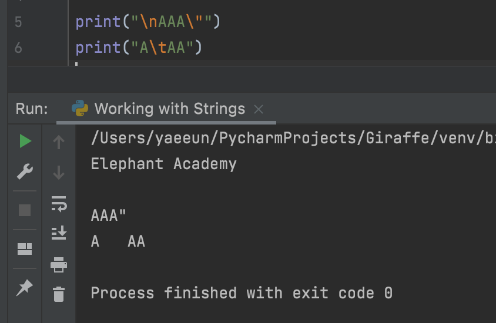

We can use **FUNCTIONS** to;

1. Modify our strings
2. Get information about our strings.

​	phrase.lower() → 모든 글자가 lower case

​	phrase.upper()→ 모든 글자가 upper case

i.e.,

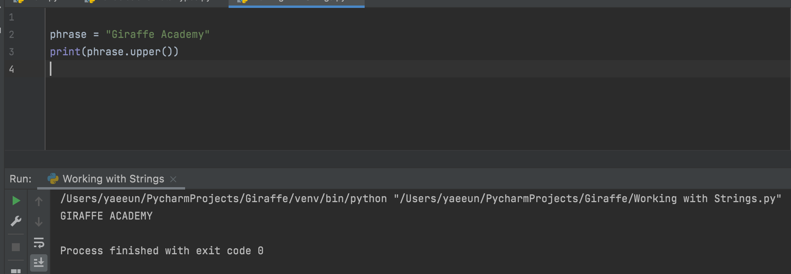

.is 가 붙으면 True/False 를 알려달라는 function

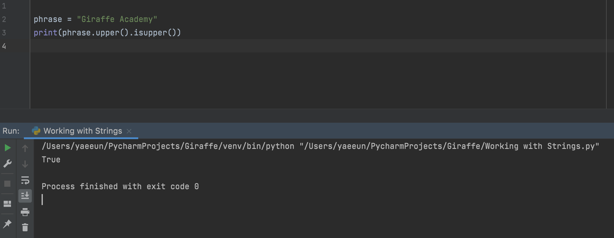

len (function) = length function (space 포함)

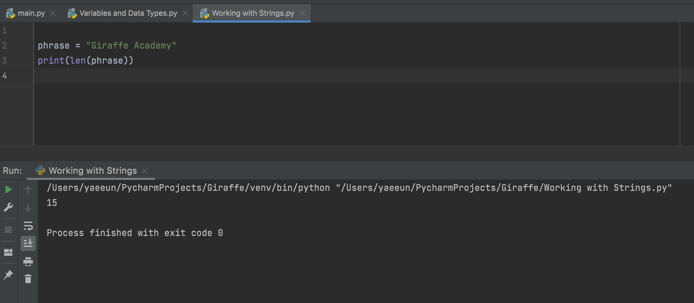

Phrase[0] → 0번째 글자
Giraffe Academy 에서 012345 순으로 G는 0, i는 1 …

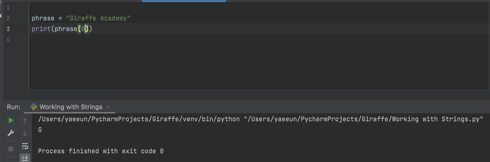

.index(“글자”) → tell where 글자 starts in the string
i.e.,G는 0번에, A는 8번에

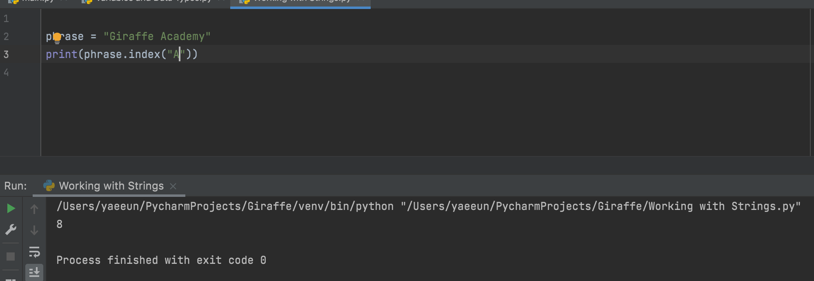

.replace(“A”, “B”) → A를  B로 바꿔주는 function

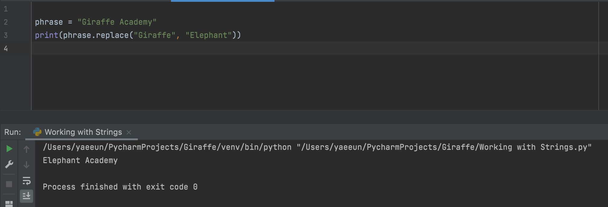

**Working with Numbers**

print(3 + 4 * 5)를 하면 곱하기 → 더하기 순으로 알아서 계산

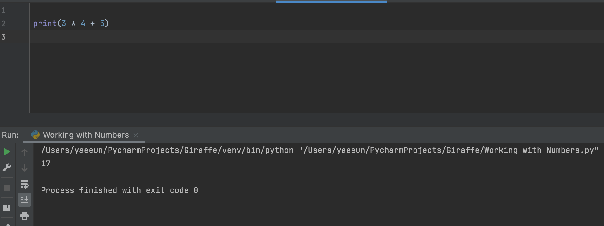

print(10 % 3) → 10을 3으로 나누고 **REMAINDER (****나머지****)**를 알려줌

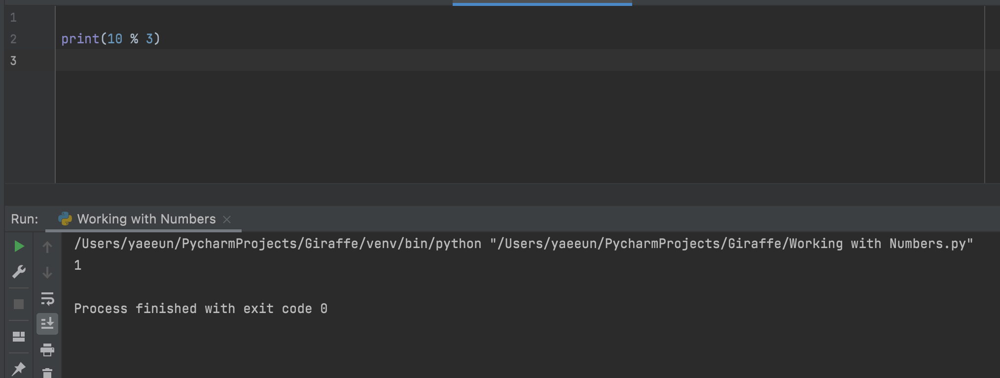

str(my_num)을 작성하면,

이제  my_num 가 string 으로 변형이 되어서, 다른 string 과 합칠 수 있음

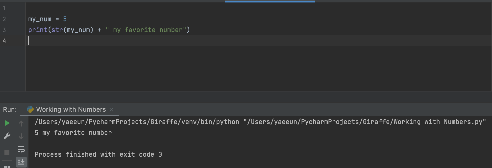

print(abs(my_num)) → absolute number 로 표시됨.

-5 → |-5| = 5

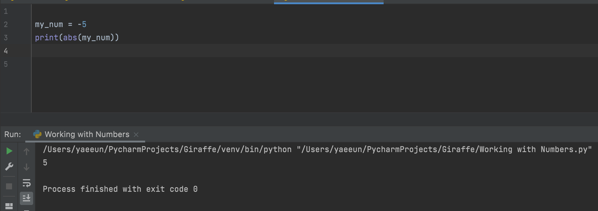

print(pow(3, 2)) → 3의 제곱 (=9)

print(pow(4, 6)) → 4의 6승 (=4096)

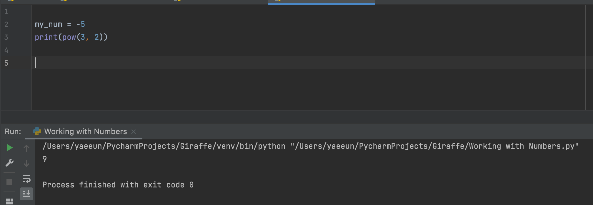

print(max(4, 6)) → 4와 6 중에 max (큰 숫자)를 표시

print(min(4, 6)) → 4와 6 중에 min (작은 숫자)를 표시

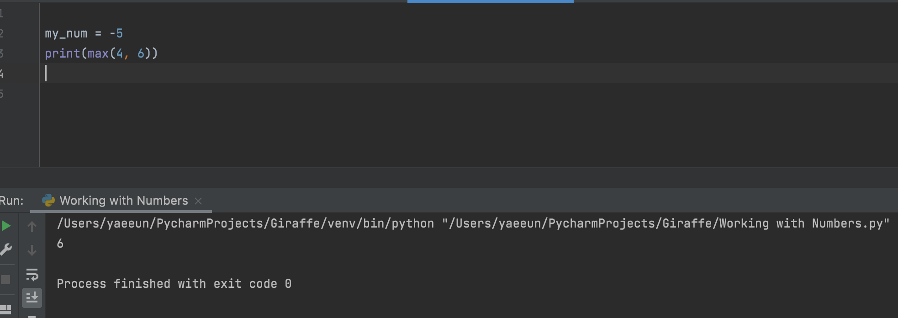

print(round(3.2)) → 3.2 를 round up/down 하는 function

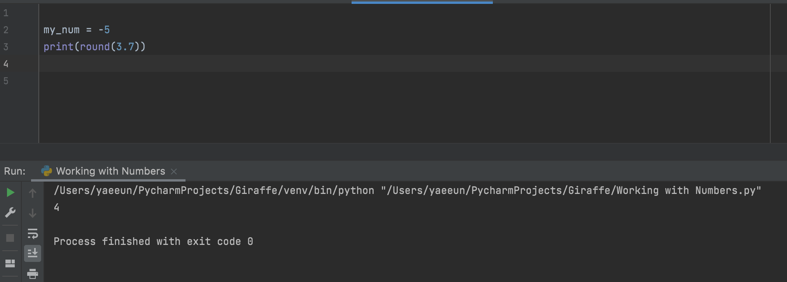

print(floor(3.7)) → 3.7을 무조건 낮춰서 3으로 표시

print(ceil(3.2)) → 3.2를 올려서 4로 표시

print(sqrt(36)) → 36을 square root 한다는 의미

단 위에 **from math import \*** 을 표시해야힘

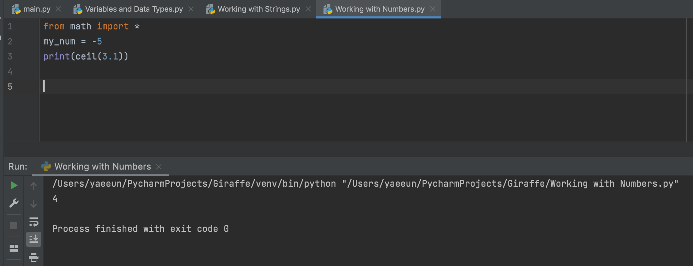

**Getting Input From Users (사용자에게 입력값 받기)**

IO function (=Input/output function)

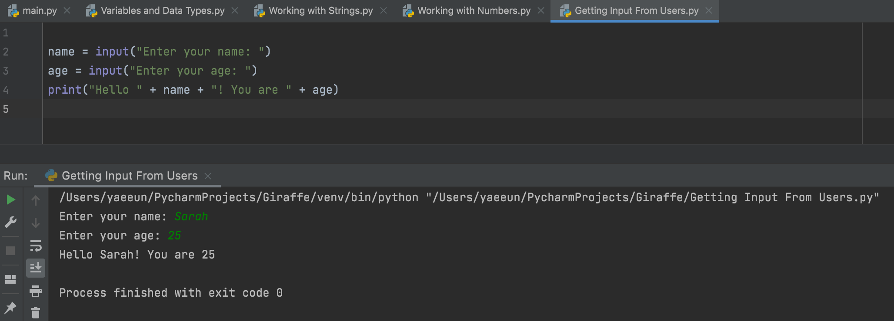

**Building a Basic Calculator (간단한 계산기 만들기)**

Num1 과 2를 숫자가 아닌 string 으로 인식을 해버려서 4+2 = 6이 아닌42로 표시가 됨.

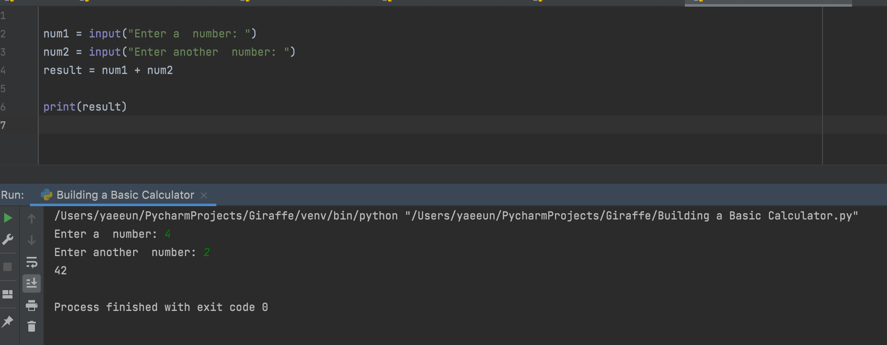

int(num1) → num1의 whole number를 숫자로 표시 (BUT not for decimal numbers)

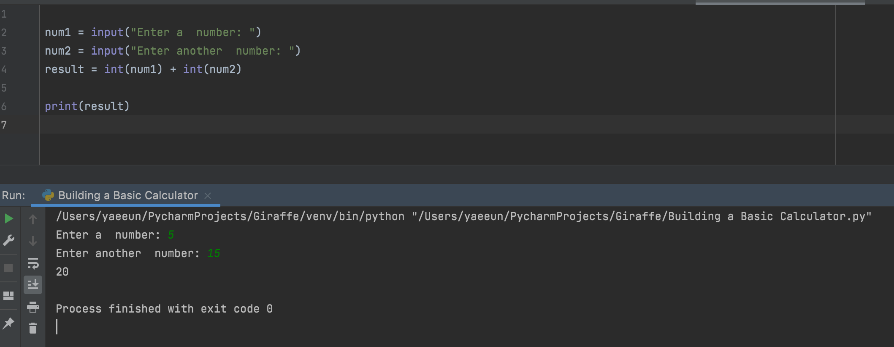

float(num1) → decimal 숫자를 숫자로 표시해서 숫자까리 더해줄 수 있게함

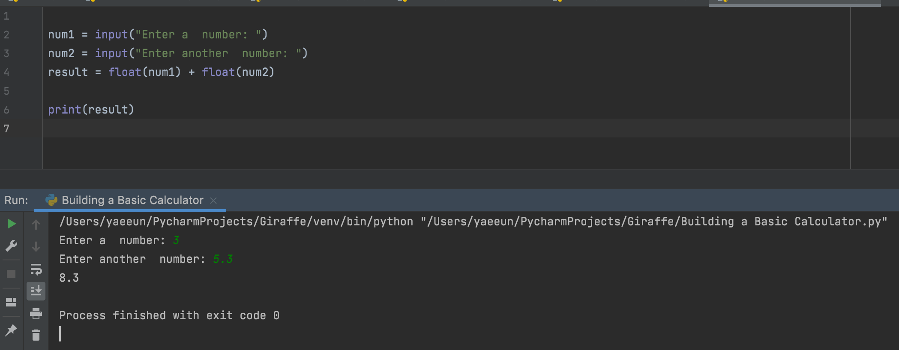

**Mad Libs Game (단어 채우기 게임)**

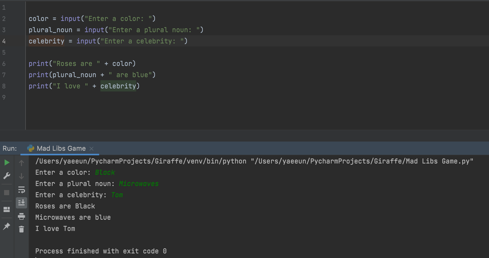

-끝-
