# Basic Python Course (2/4)

**Python 2**

**Lists**

[ ] → bunch of values inside the lists

Index는 Kelvin = 0, Karen = 1, Jim = 2

반대로 Jim = -1, Karen = -2 ,Kelvin = -3

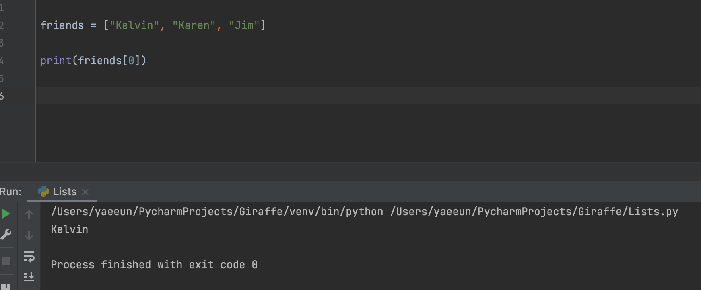

**RANGE**

아래에서 Kelvin 을 제외하고 2,3번째를 list 하고 싶으면, 

[1:] → index 1	부터 그 뒤로 쭉 list 할 수 있음

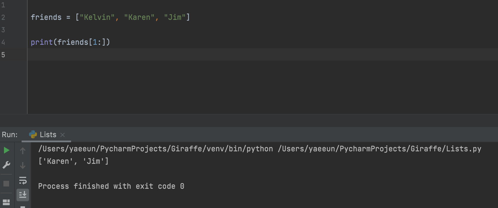

[1:3]을 하게 되면, index 1인 Karen 부터 index 3 인 Oscar 전까지 → index 1&2를 list 

1=< 이고 <3 (포함안됨) 

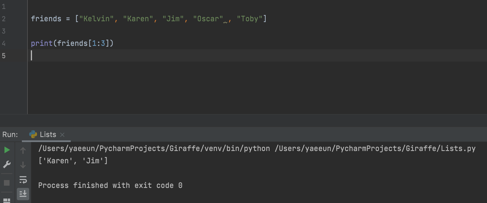

**List Functions (배열 함수)**

friends.extend(lucky_numbers) → friends + lucky_numbers 를 같이 lists up 해주는 함수

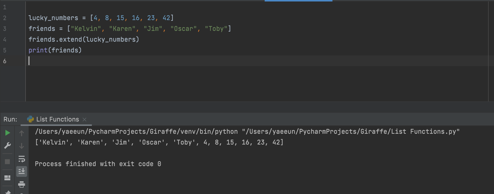

friends.append(“Creed”) → Creed 를 friends 리스트에 추가시키는 함수 (리스트 맨 마지막에 포함)

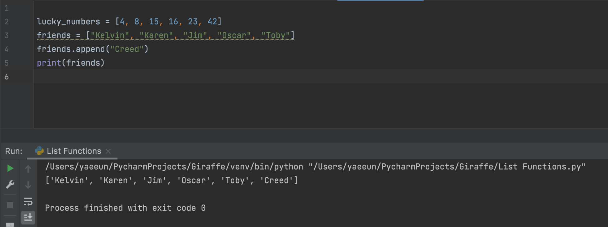

만약에 Kelly 라는 이름을 friends list 중간에 넣고 싶다면?

**friends.insert(1, “Kelly”)** → index 1에 Kelly 를 추가 & 나머지 리스트는 다 pushed back

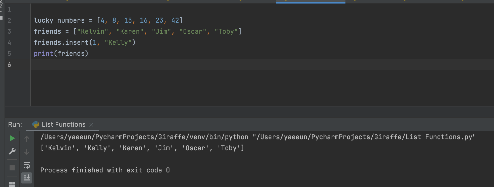

리스트에서 한명을 빼고싶다면?

friends.remove(“이름”) → 그 이름이 제외된 리스트

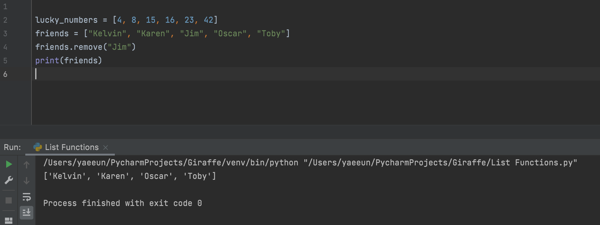

Friends list를 전체 reset하고 싶으면 .clear

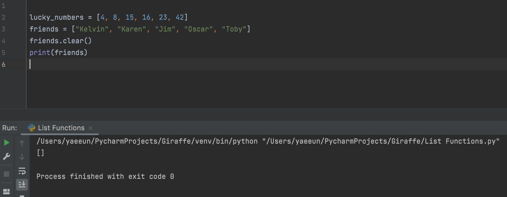

**.pop → removes the last elements of the list**

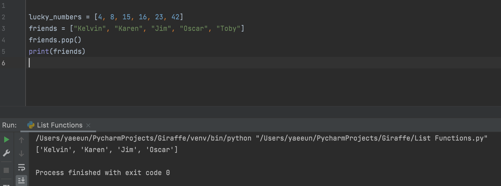

Friends list 중에서 한 사람의 이름이 들어가 있는지 알고싶으면

friends.index(“이름”) → 그 사람의 index 를 알려줌

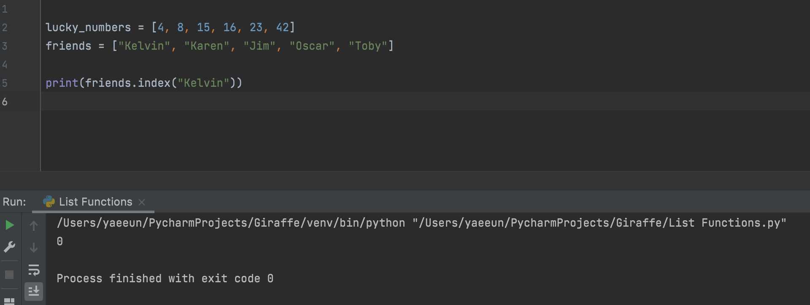

Friends list에서 Jim이라는 사람의 이름이 몇번 들어갔는지 알고싶다면 → **friends.count(“Jim”)**

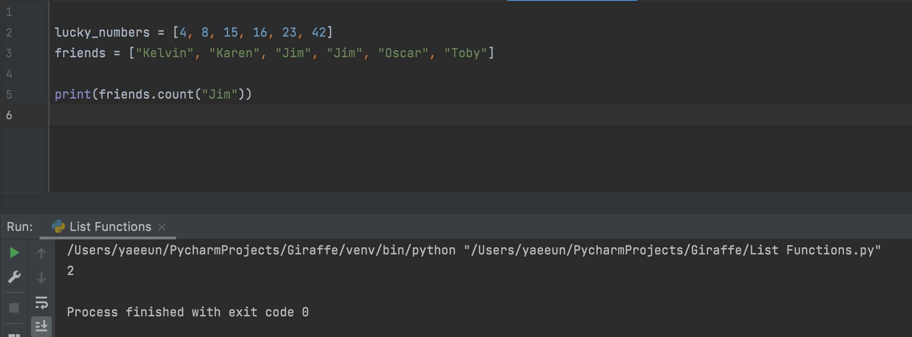

**friends.sort()** → 알파벳 순서로 순서대로 나옴

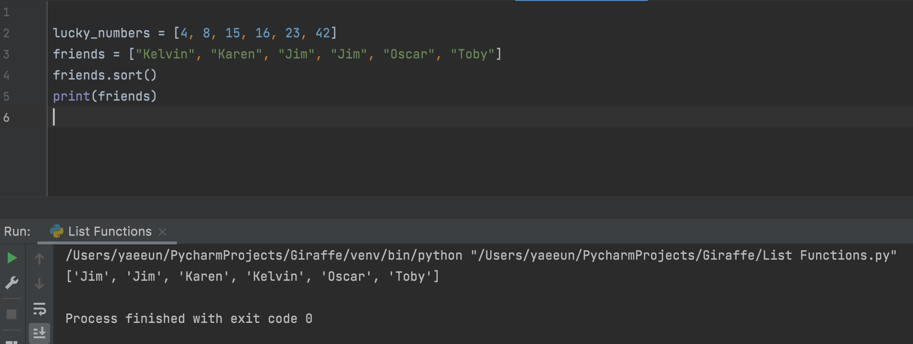

lucky_numbers.reverse() → lucky_numbers의 순서를 반대로 표현

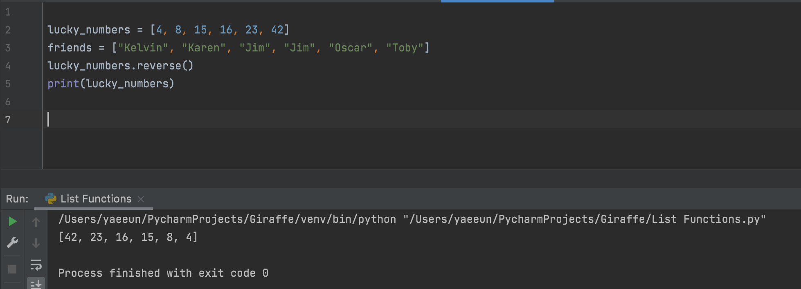

Copy function

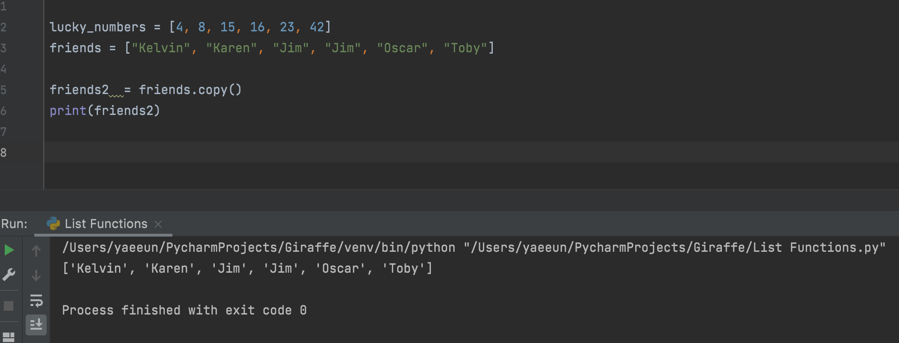

**Tuples**

** **Tuples cannot be modified**.

▶ 리스트와 유사하지만 immutable(불변)

  즉, 리스트처럼 요소 삭제, 추가, 변경 불가능 

  --> 중요한 정보를 저장할 때 용이하게 쓰임!

**Functions (함수)**

say_hi () → () 들어가 있는게 **parameter**: 

say_hi(input1, input2) ; input 1 → **argument** 1, **argument** 2

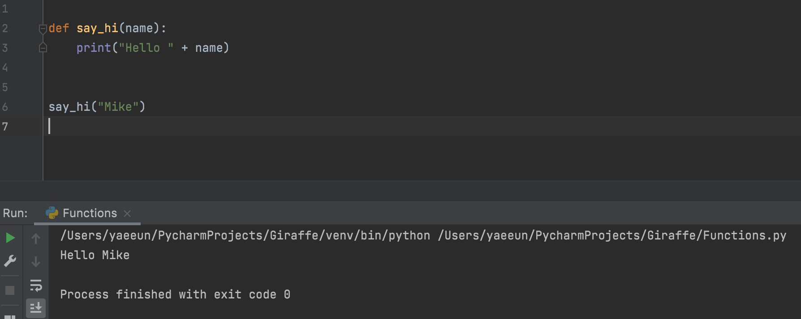

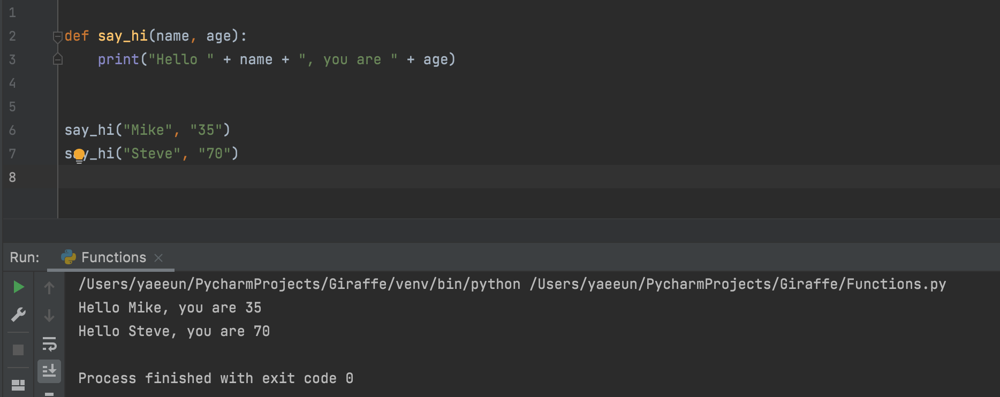

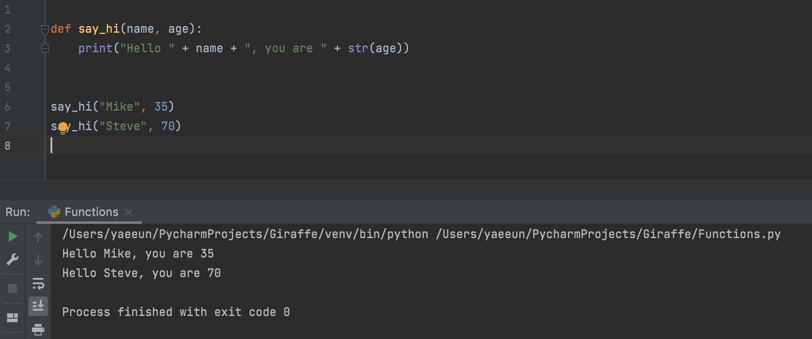

**Return Statement (변환문)**

Return 명령어 사용 : return 이라는 명령어를 만나면 함수 코드가 종료되고, 해당 함수를 호출한 곳으로 되돌아가게 함.

I.e., 

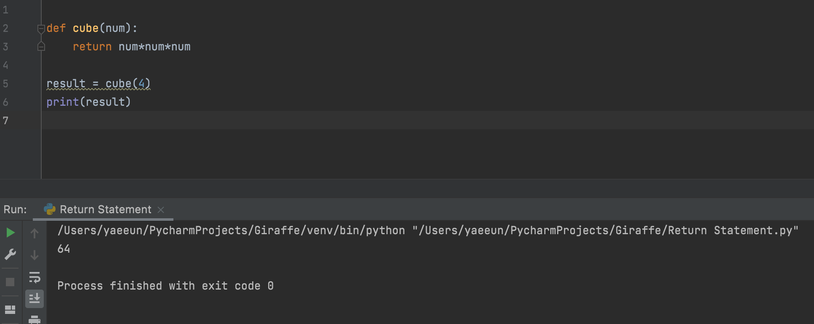

**If Statements (조건문)**

is_male 이 True/False에 한에,

만약 남자면 “you are a male”의 statement 가 나오고,

아니면 “you are not a male”의 statement 가 나옴.

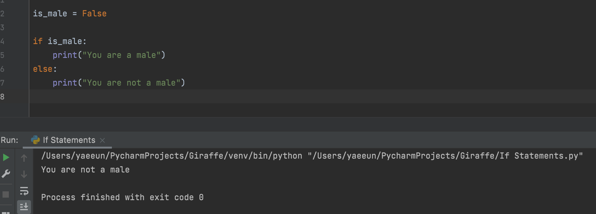

한개의 If statement 가 아니라 2개의 조건문이 들어가면,

아래의 if statement 처럼 표현

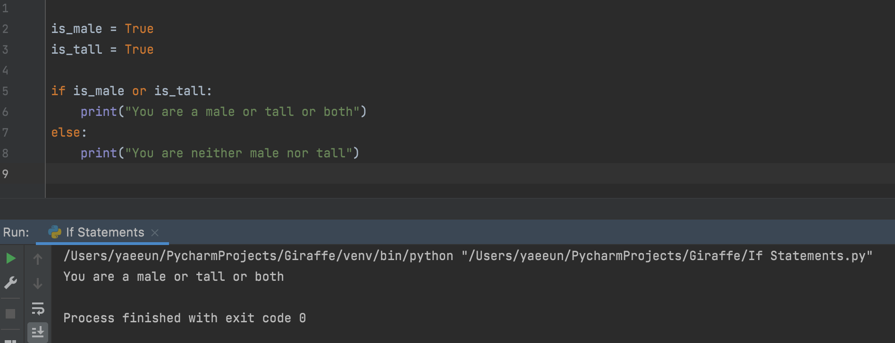

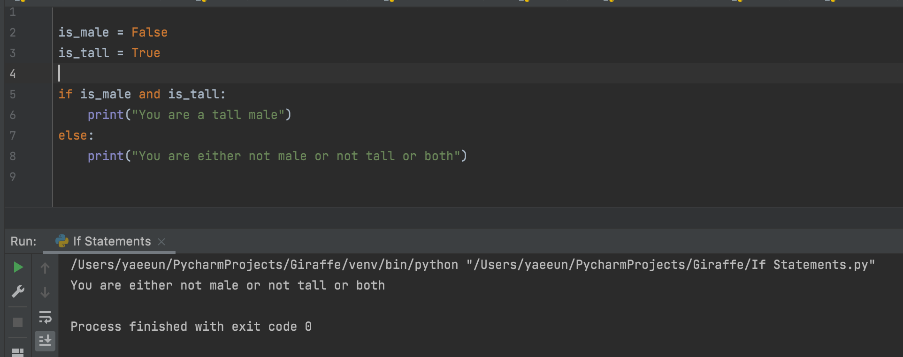

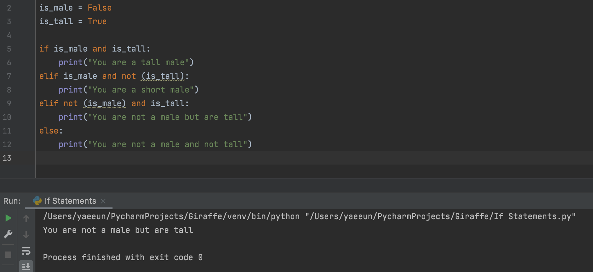

**If Statements & Comparisons**

**🍯Tip:**

!= → not equal

\>= → greater than or equal to

== → equal to 

+= increment

-= decrement

* [파이썬(Python) 배우기 - 초심자를 위한 기초강의모음](https://www.youtube.com/watch?v=rfscVS0vtbw)
  * 파이썬(Python) 배우기 - 초심자를 위한 기초강의모음

-끝-
